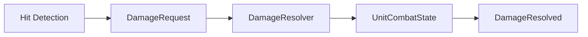

# Combat Damage Pipeline

이 폴더는 R.I.P의 전투 처리 중 `DamageRequest → DamageResolver → DamageResolved` 흐름을 선별한 코드 샘플입니다.

## 파일 구성

| 파일 | 역할 |
|---|---|
| `DamageRequest.cs` | 공격자·대상·피해량·충격량·공격 ID를 담는 불변 요청 데이터 |
| `DamageResolver.cs` | State Authority에서 Nullification Field, Shield, Armor, ACS 순서로 피해 계산 |
| `DamageResolved.cs` | 계산 전후 AP·ACS와 최종 처리 결과를 담는 불변 결과 데이터 |
| `IDamageReceiver.cs` | 공격 판정 계층이 요청을 전달하기 위한 인터페이스 |
| `DamageType.cs` | 물리·에너지·폭발 피해 분류 |

## 처리 순서

1. 음수 Damage와 Impact를 0으로 보정합니다.
2. 배치형 무효화 필드를 개인 Shield보다 먼저 판정합니다.
3. Shield가 흡수한 수치를 분리합니다.
4. 남은 피해에 방어 타입별 Armor 감소를 적용합니다.
5. ACS Overload 상태라면 AP 피해 배율을 적용합니다.
6. State Authority가 AP와 ACS를 반영하고 `DamageResolved`를 반환합니다.

## 네트워크 규칙

- 실제 수치 변경은 `HasStateAuthority`를 가진 객체만 수행합니다.
- `AttackId`는 공격 소스, 공격 객체, Simulation Tick을 조합해 중복 판정 식별에 사용합니다.
- 요청과 결과를 분리해 VFX·UI·로그가 계산 로직에 직접 의존하지 않도록 했습니다.

## 공개용 검토 반영

- 기존 `RIP.Waepons` 네임스페이스 오타를 `RIP.Weapons`로 수정했습니다.
- 음수 Impact 보정값이 실제 적용 단계에서도 일관되게 사용되도록 수정했습니다.

## 범위

이 코드는 원본 Unity 프로젝트에서 선별한 검토용 샘플입니다. `UnitCombatState`, `MultiplayerMatchManager`와 Photon Fusion 런타임은 원본 Private 저장소에 포함되어 있으므로 이 폴더만으로는 독립 실행되지 않습니다.
