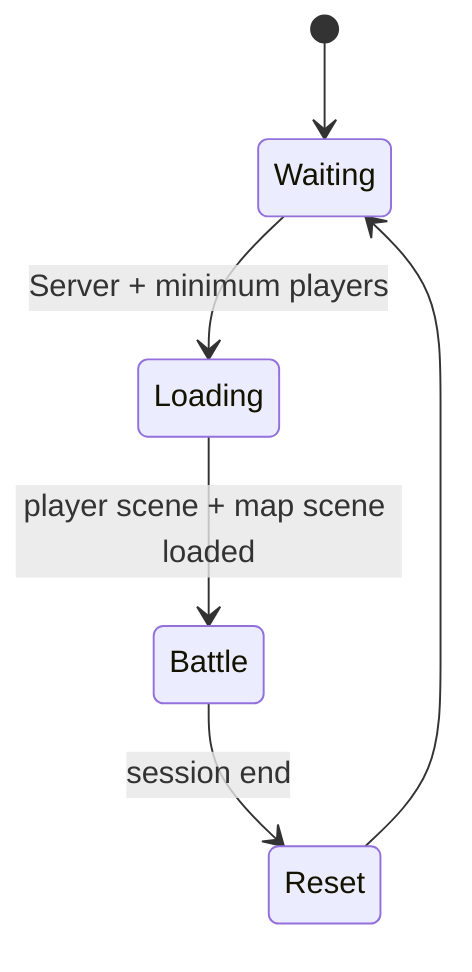

# Match Flow

이 폴더는 R.I.P의 **방 준비 상태 확인·세션 잠금·전투 씬 로딩·Host 권한 기반 플레이어 생성** 흐름을 선별한 코드 샘플입니다.

## Included File

| 파일 | 역할 |
|---|---|
| [NetworkMatchFlow.cs](./NetworkMatchFlow.cs) | 전투 시작 조건, 세션 잠금, 싱글·멀티 씬 전환, Server 전용 플레이어 생성 제어 |

## State Flow

## Authority Rules

- `runner.IsServer`인 인스턴스만 전투 시작과 플레이어 생성을 수행합니다.
- 최소 참가 인원을 충족한 경우에만 멀티플레이 전투를 시작합니다.
- 전투 준비가 끝나면 세션을 닫고 검색 목록에서 숨겨 중도 입장을 방지합니다.
- Player Scene은 Single, 선택된 Map Scene은 Additive 방식으로 로드합니다.
- 씬 로딩 완료 후 Server가 활성 플레이어의 Loadout을 확인하고 Spawn합니다.
- 싱글 플레이는 같은 흐름 객체를 사용하되 Map Scene 진입 경로를 분리합니다.

## Scope

실제 제한 시간·사망·타임아웃·최종 승패 계산은 원본 Private 저장소의 `MultiplayerMatchManager`가 담당합니다. 해당 클래스는 UI, Loadout, PlayerHealth 등 의존성이 크므로 통째로 공개하지 않고 이 샘플에서는 전투 진입과 권한 흐름만 보여줍니다.
