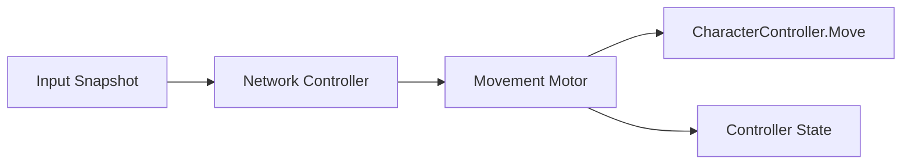

# Movement Pipeline

이 폴더는 R.I.P의 이동 시스템에서 **일반 이동·공중 상승·회전·부스트 전환 후 감속**을 담당하는 계산 계층을 선별한 코드 샘플입니다.

## Included File

| 파일 | 역할 |
|---|---|
| [PlayerMovementMotor.cs](./PlayerMovementMotor.cs) | 입력 방향과 네트워크 상태를 받아 수직·수평 속도와 회전을 계산하고 CharacterController에 한 번만 적용 |

## Execution Flow

1. 네트워크 Tick에서 입력과 현재 상태를 전달합니다.
2. 수직 이동에서 접지·점프·공중 상승과 에너지 소비를 계산합니다.
3. 수평 이동에서 기본 이동·부스트·해제 감속·방향 전환 가속도를 계산합니다.
4. Hard Lock, 발사 방향, 이동 방향 순서로 바라볼 방향을 결정합니다.
5. 최종 속도를 `CharacterController.Move`에 한 번만 전달합니다.

## Design Decisions

- 한 프레임에 여러 컴포넌트가 이동을 중복 적용하지 않도록 실제 이동 호출을 한 곳에 모았습니다.
- 계산에 필요한 상태는 `PlayerControllerData`, 튜닝 값은 `PlayerMovementStats`로 분리했습니다.
- Quick Boost와 Assault Boost 종료 직후에는 별도 제동 값을 사용해 급격한 속도 전환을 제어합니다.
- Boost 점화 구간은 남은 Tick 비율로 속도 배율을 보간합니다.
- Hard Lock 중에는 이동 방향과 별개로 타겟을 바라볼 수 있습니다.

## Public Review Changes

- 포인터를 사용하지 않는 클래스에 남아 있던 불필요한 `unsafe` 한정자를 제거했습니다.

## Scope

원본 프로젝트의 `PlayerNetworkController`, `PlayerControllerData`, `PlayerMovementStats`, `PlayerEnergy`는 다른 시스템과 결합도가 높아 이 샘플에서 제외했습니다. 따라서 이 폴더만으로 독립 실행되지는 않으며, 이동 계산 책임을 검토하기 위한 코드입니다.
