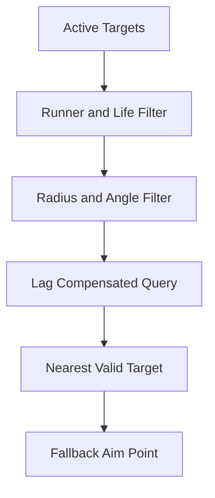

# Targeting Pipeline

이 폴더는 R.I.P의 **Hard Lock 대상 등록·후보 필터링·Photon Fusion Lag Compensation 기반 무기 탐색**을 선별한 코드 샘플입니다.

## Included Files

| 파일 | 역할 |
|---|---|
| [HardLockTarget.cs](./HardLockTarget.cs) | 활성 타겟을 정적 레지스트리에 등록하고 조준 기준점을 제공 |
| [HardLockTargetScanner.cs](./HardLockTargetScanner.cs) | 자기 자신·다른 Runner·사망 대상을 제외하고 거리 내 Hard Lock 후보 수집 |
| [WeaponTargetScanner.cs](./WeaponTargetScanner.cs) | Lag Compensation OverlapSphere와 시야각을 이용해 가장 가까운 유효 무기 타겟 선택 |

## Target Selection Flow

## Validation Rules

- 공격자 자신의 `NetworkObject`는 제외합니다.
- 서로 다른 `NetworkRunner`에 속한 객체는 후보에 포함하지 않습니다.
- 사망한 `PlayerHealth`는 Hard Lock 후보에서 제외합니다.
- 무기 탐색은 `HitOptions.SubtickAccuracy`와 `IgnoreInputAuthority`를 사용합니다.
- 검색 반경과 시야각을 통과한 후보 중 가장 가까운 위치를 선택합니다.
- 유효한 후보가 없으면 발사 방향 앞쪽의 Fallback 지점을 반환합니다.

## Public Review Changes

- 기존 `RIP.Waepons.Targeting` 네임스페이스 오타를 `RIP.Weapons.Targeting`으로 수정했습니다.
- 타겟 등록, 일반 Hard Lock 검색, 네트워크 보정 무기 검색을 별도 클래스로 유지했습니다.

## Scope

카메라 전환과 입력 순환을 담당하는 `PlayerHardLockController`는 UI·카메라·네트워크 의존성이 커서 공개 샘플에서 제외했습니다. 이 폴더는 탐색 규칙과 네트워크 판정 방식을 보여주는 데 집중합니다.
