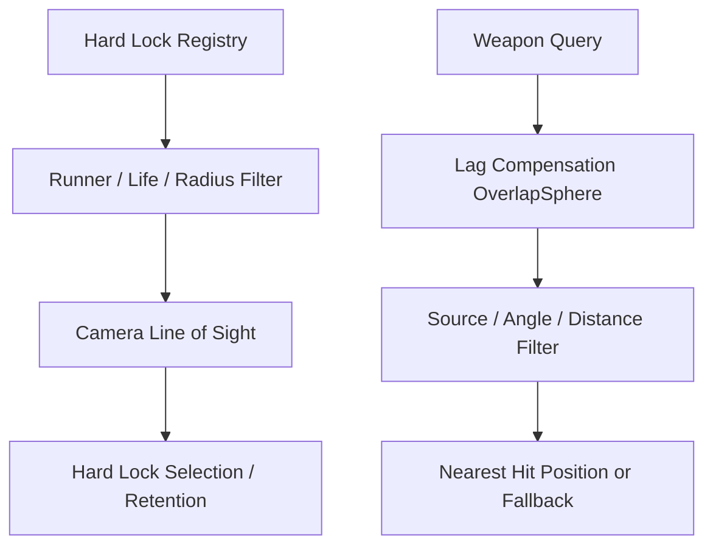

# Targeting

개인 구현의 하드락 후보·시야 검사와 팀 공동 무기 계층에서 사용하는 보정 탐색 코드입니다.

## Files

| 파일 | 역할 |
|---|---|
| [HardLockTarget.cs](./HardLockTarget.cs) | 활성 타겟 등록과 조준 기준점 |
| [HardLockTargetScanner.cs](./HardLockTargetScanner.cs) | 자기 자신·다른 Runner·사망 대상을 제외하고 거리 내 후보 수집 |
| [PlayerHardLockController.LineOfSight.cs](./PlayerHardLockController.LineOfSight.cs) | 카메라와 대상 사이 시야 검사 멤버 발췌 |
| [WeaponTargetScanner.cs](./WeaponTargetScanner.cs) | Lag Compensation 쿼리·시야각으로 가장 가까운 무기 타겟 선택 |

## Selection Paths

```mermaid
flowchart TD
    H[Hard Lock Registry] --> F[Runner / Life / Radius Filter]
    F --> V[Camera Line of Sight]
    V --> L[Hard Lock Selection / Retention]
    W[Weapon Query] --> Q[Lag Compensation OverlapSphere]
    Q --> A[Source / Angle / Distance Filter]
    A --> T[Nearest Hit Position or Fallback]
```

Hard Lock 스캐너는 활성 여부·Runner·생존·반경을 검사합니다. Controller의 시야 검사는 카메라에서 대상 AimPoint까지 RaycastNonAlloc을 수행해 자기 자신과 대상 Collider를 제외한 차폐물을 확인합니다. 입력·화면 중심 후보 선택·락 유지 로직은 발췌 범위 밖입니다.

무기 탐색은 SubtickAccuracy·IgnoreInputAuthority 옵션의 보정 구 쿼리에서 자기 자신을 제외하고 각도·거리 조건으로 후보를 선택합니다. 실패하면 발사 방향 앞쪽 fallback을 반환합니다. 이 스캐너 자체에는 하드락 스캐너의 명시적인 사망 필터나 시야 Raycast가 없습니다.

## Dependencies

Photon Fusion, PlayerHealth와 나머지 카메라·입력 계층이 필요합니다. 시야 검사 파일은 Controller의 관련 멤버만 포함하며 샘플은 단독 실행되지 않습니다.
