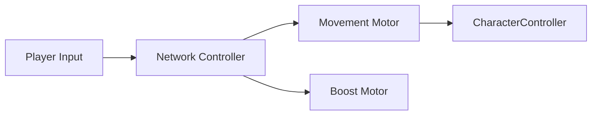
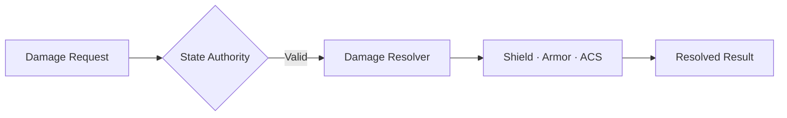

  <h1>R.I.P – Rusty Iron Project</h1>
  <h3>High-Speed Mecha Combat · Networked PvP · Modular Weapons</h3>
  
Unity 6 기반으로 제작 중인 3D 메카 액션 프로젝트입니다. 고속 기동, 다양한 무기 조합, 싱글 플레이와 네트워크 대전을 하나의 전투 구조로 구현합니다.

  

    
    
    
    
  

  
<a href="https://wjddh1998.itch.io/rusty-iron-project"><strong>⬇ Playable Windows Build</strong></a> · <a href="#code-samples"><strong>🧩 Review Code Samples</strong></a>

  
<a href="#overview">Overview</a> · <a href="#my-role">My Role</a> · <a href="#core-systems">Core Systems</a> · <a href="#code-samples">Code Samples</a> · <a href="#tech-stack">Tech Stack</a>

---

## Gameplay Preview

> Gameplay 영상과 기능별 GIF는 Public 전환 전 추가합니다. 현재 Windows Alpha 빌드와 데모 영상은 [itch.io 프로젝트 페이지](https://wjddh1998.itch.io/rusty-iron-project)에서 확인할 수 있습니다.

<!-- Public 전환 전 docs/images의 Gameplay, Quick Boost, Lock-On, PvP GIF를 이 위치에 배치합니다. -->

## Overview

| 항목 | 내용 |
|---|---|
| Genre | 3D Mecha Action · PvE · PvP |
| Development | 2026.06 – Present |
| Team | 3명 |
| Role | 팀장 · Unity Client / Gameplay Programmer |
| Engine | Unity 6000.4.11f1 |
| Repository | 채용 검토용 Showcase |
| Playable Build | [Windows Alpha on itch.io](https://wjddh1998.itch.io/rusty-iron-project) |

### Project Focus

| High-Speed Movement | Combat Pipeline | Multiplayer |
|---|---|---|
| 지상·공중 기동, Quick Boost, Assault Boost | Projectile, Shield, AP, ACS, Lock-On | Photon Fusion 2, State Authority, Match Flow |

## My Role

- CharacterController 기반 이동 및 지상·공중 기동
- Quick Boost / Assault Boost와 에너지 소비
- Hard Lock 및 무기별 타겟 탐색
- Projectile·Damage·Shield·ACS 전투 처리
- Photon Fusion 2 기반 플레이어 상태 동기화
- State Authority 기반 데미지 및 승패 판정
- 싱글·멀티 씬 전환과 PvP Match Flow
- Unity Gaming Services 인증·Cloud Save·Leaderboard 연동

## Core Systems

### 1. Networked Movement

`FixedUpdateNetwork`에서 입력을 수집하고 네트워크 상태, 이동 계산, 프레젠테이션을 분리했습니다. 이동과 부스트가 같은 Tick에 중복 적용되지 않도록 하나의 컨트롤러가 실행 순서를 조정합니다.

### 2. Authoritative Damage

공격 판정과 AP·ACS·Shield 반영을 요청·계산·결과 단계로 분리했습니다. 최종 수치 변경은 State Authority만 수행합니다.

### 3. Targeting

Hard Lock 대상 등록과 후보 필터링을 분리하고, 무기 발사 탐색에는 Photon Fusion Lag Compensation을 사용합니다. 자기 자신·다른 Runner·사망 대상을 제외한 뒤 검색 반경과 시야각을 통과한 가장 가까운 후보를 선택합니다.

### 4. Match Flow

Host의 State Authority를 기준으로 참가 인원 확인, 세션 잠금, 전투 씬 로딩, 플레이어 Spawn을 제어합니다. 제한 시간·사망·타임아웃에 따른 승패 판정은 별도의 Match Manager가 담당합니다.

## Code Samples

| 영역 | 코드 | 확인할 수 있는 내용 |
|---|---|---|
| Combat | [CodeSamples/Combat](./CodeSamples/Combat/README.md) | Request–Resolver–Result 분리, Authority 검증, Shield·Armor·ACS 처리 순서 |
| Movement | [CodeSamples/Movement](./CodeSamples/Movement/README.md) | 수직·수평 이동 계산, 에너지 소비, 회전 우선순위, 단일 이동 Writer |
| Targeting | [CodeSamples/Targeting](./CodeSamples/Targeting/README.md) | Hard Lock 후보 필터링, Runner 검증, Lag Compensation 탐색 |
| Match Flow | [CodeSamples/MatchFlow](./CodeSamples/MatchFlow/README.md) | 싱글·멀티 진입, 세션 잠금, Server 전용 Spawn 흐름 |

## Technical Decisions

- **Single movement writer**: 실제 CharacterController 이동을 한 계층에 모아 중복 적용을 방지했습니다.
- **Authority-first combat**: 최종 AP·ACS 변경은 State Authority만 수행합니다.
- **Request/Result separation**: 판정 데이터와 적용 결과를 분리해 UI·VFX·로그가 계산 로직에 직접 결합되지 않게 했습니다.
- **Lag-compensated targeting**: 멀티플레이 무기 탐색에 Subtick Accuracy 기반 보정 쿼리를 사용합니다.
- **Explicit match ownership**: 전투 시작과 Spawn은 Server만 수행하며, 전투 시작 후 세션을 닫습니다.
- **Data-driven tuning**: 이동·무기 설정은 ScriptableObject 기반 데이터로 관리합니다.

## Tech Stack

| 분류 | 기술 |
|---|---|
| Engine | Unity 6000.4.11f1 · URP |
| Language | C# |
| Networking | Photon Fusion 2 · Host Mode · State Authority |
| Backend | Unity Gaming Services Authentication · Cloud Save · Leaderboards |
| Gameplay | CharacterController · Modular Weapons · Projectile · Shield · ACS |
| Tools | Git · GitHub · Notion |

## Repository Scope

이 저장소는 채용 검토용 Showcase입니다. 원본 Unity 프로젝트는 팀 작업물과 라이선스가 있는 외부 에셋을 포함하고 있어 Private으로 유지합니다.

공개 범위에는 다음 항목만 포함합니다.

- 직접 구현하고 설명 가능한 핵심 C# 코드
- 시스템 구조와 Authority 규칙 문서
- 프로젝트 소개 및 추후 추가할 Gameplay 미디어

코드 샘플은 핵심 책임을 검토하기 위한 선별본이며, 원본 프로젝트의 전체 의존성과 에셋을 포함하지 않아 단독 실행되지 않습니다.
