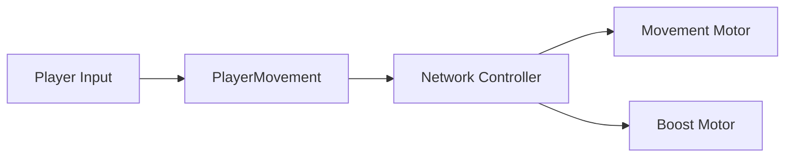
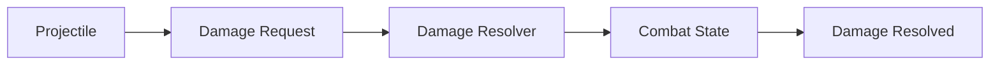

# R.I.P – Rusty Iron Project

> Unity 6 기반의 고속 메카 액션 멀티플레이 프로젝트입니다.

## 프로젝트 개요

| 항목 | 내용 |
|---|---|
| 장르 | 3D 메카 액션 / PvE / PvP |
| 개발 기간 | 2026.06 – 현재 |
| 팀 구성 | 3인 팀 |
| 담당 | 팀장 · Unity 클라이언트 / 게임플레이 프로그래밍 |
| 엔진 | Unity 6000.4.11f1 |

다양한 무기 조합과 고속 기동을 중심으로, 싱글 플레이와 네트워크 대전을 하나의 전투 구조 안에서 구현하는 것을 목표로 개발하고 있습니다.

## 담당 기능

- CharacterController 기반 이동 및 지상·공중 기동
- Quick Boost / Assault Boost와 에너지 소비
- Hard Lock 및 무기별 타겟 탐색
- Projectile·Damage·Shield·ACS 전투 처리
- Photon Fusion 2 기반 플레이어 상태 동기화
- State Authority 기반 데미지 및 승패 판정
- 싱글·멀티 씬 전환과 PvP Match Flow
- Unity Gaming Services 인증·Cloud Save·Leaderboard 연동

## 기술 스택

| 영역 | 기술 |
|---|---|
| Client | Unity 6, C# |
| Network | Photon Fusion 2 |
| Backend | Unity Gaming Services Authentication, Cloud Save, Leaderboards |
| Rendering | URP, Visual Effect Graph |
| Input / Animation | Input System, Animation Rigging |

## 핵심 시스템

### 1. 네트워크 이동과 부스트

`FixedUpdateNetwork`에서 입력을 처리하고, 네트워크 상태와 실제 이동 계산을 분리했습니다. 이동·부스트·프레젠테이션 책임을 각각 분리하여 한 프레임에 여러 이동 로직이 충돌하지 않도록 구성했습니다.

### 2. 데미지 처리 파이프라인

공격 판정과 실제 AP·ACS·Shield 반영을 분리했습니다. 최종 수치는 State Authority에서 계산하며, 처리 결과를 별도 데이터로 반환합니다.

### 3. 락온과 무기 타겟 탐색

Hard Lock 대상과 무기 발사 시점의 타겟 제공자를 분리했습니다. 멀티플레이에서는 Fusion Lag Compensation을 사용해 탐색 시점의 위치 차이를 줄였습니다.

### 4. 매치 진행

Host의 State Authority를 기준으로 참가자 준비 상태, 전투 시작, 3분 타이머, 사망·타임아웃 판정과 결과 화면 전환을 관리합니다.

## 공개 코드 샘플

다음 코드는 정리와 검증을 마친 뒤 이 저장소에 순차적으로 추가합니다.

- `CodeSamples/Combat`: Damage Request → Resolver → Resolved
- `CodeSamples/Movement`: 이동 모터와 네트워크 상태 데이터
- `CodeSamples/Targeting`: Hard Lock과 무기 타겟 탐색
- `CodeSamples/MatchFlow`: 싱글·멀티 전투 진행

## 미디어

> 게임플레이 영상과 기능별 GIF는 Public 전환 전 추가할 예정입니다.

## 저장소 공개 범위

이 저장소는 채용 검토를 위한 Showcase입니다. 원본 Unity 프로젝트는 외부 에셋과 팀 작업물을 포함하고 있어 Private으로 유지하며, 여기에는 제가 작성한 코드와 직접 제작한 문서·미디어만 선별하여 공개합니다.
