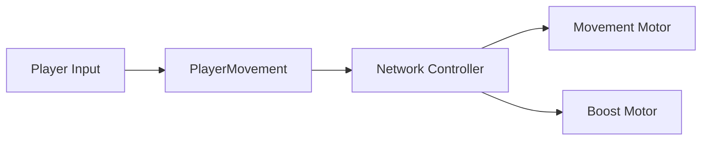
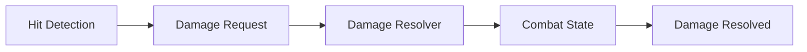

  <h1>R.I.P – Rusty Iron Project</h1>
  <h3>High-Speed Mecha Combat · Networked PvP · Modular Weapons</h3>
  
Unity 6 기반으로 제작 중인 3D 메카 액션 프로젝트입니다. 고속 기동, 다양한 무기 조합, 싱글 플레이와 네트워크 대전을 하나의 전투 구조로 구현합니다.

  

    
    
    
    
  

  
<a href="#overview">Overview</a> · <a href="#my-role">My Role</a> · <a href="#core-systems">Core Systems</a> · <a href="#code-samples">Code Samples</a> · <a href="#tech-stack">Tech Stack</a>

---

## Gameplay Preview

> Gameplay 영상과 기능별 GIF는 Public 전환 전 추가합니다.

<!-- Public 전환 전 docs/images의 Gameplay, Quick Boost, Lock-On, PvP GIF를 이 위치에 배치합니다. -->

## Overview

| 항목 | 내용 |
|---|---|
| Genre | 3D Mecha Action · PvE · PvP |
| Development | 2026.06 – Present |
| Team | 3명 |
| Role | 팀장 · Unity Client / Gameplay Programmer |
| Engine | Unity 6000.4.11f1 |
| Repository | 채용 검토용 Showcase |

### Project Focus

| High-Speed Movement | Combat Pipeline | Multiplayer |
|---|---|---|
| 지상·공중 기동, Quick Boost, Assault Boost | Projectile, Shield, AP, ACS, Lock-On | Photon Fusion 2, State Authority, Match Flow |

## My Role

- CharacterController 기반 이동 및 지상·공중 기동
- Quick Boost / Assault Boost와 에너지 소비
- Hard Lock 및 무기별 타겟 탐색
- Projectile·Damage·Shield·ACS 전투 처리
- Photon Fusion 2 기반 플레이어 상태 동기화
- State Authority 기반 데미지 및 승패 판정
- 싱글·멀티 씬 전환과 PvP Match Flow
- Unity Gaming Services 인증·Cloud Save·Leaderboard 연동

## Core Systems

### 1. Networked Movement

`FixedUpdateNetwork`에서 입력을 수집하고 네트워크 상태, 이동 계산, 프레젠테이션을 분리했습니다. 이동과 부스트가 동일 프레임에 중복 적용되지 않도록 하나의 컨트롤러가 실행 순서를 조정합니다.

### 2. Authoritative Damage

공격 판정과 AP·ACS·Shield 반영을 요청·계산·결과 단계로 분리했습니다. 최종 수치 변경은 State Authority만 수행합니다.

### 3. Targeting

Hard Lock 대상 관리와 무기 발사 시점의 타겟 제공자를 분리했습니다. 멀티플레이 탐색에는 Fusion Lag Compensation을 사용합니다.

### 4. Match Flow

Host의 State Authority를 기준으로 참가자 준비 상태, 전투 시작, 3분 타이머, 사망·타임아웃 판정과 결과 화면 전환을 관리합니다.

## Code Samples

| 영역 | 코드 | 확인할 수 있는 내용 |
|---|---|---|
| Combat | [`CodeSamples/Combat`](CodeSamples/Combat) | Request–Resolver–Result 분리, Authority 검증, Shield·Armor·ACS 처리 순서 |
| Movement | `CodeSamples/Movement` *(준비 중)* | 이동 계산과 네트워크 상태 분리 |
| Targeting | `CodeSamples/Targeting` *(준비 중)* | Hard Lock과 Lag Compensation 탐색 |
| Match Flow | `CodeSamples/MatchFlow` *(준비 중)* | 싱글·멀티 씬 및 승패 흐름 |

## Technical Decisions

- **Server-authoritative results** — 클라이언트 입력과 실제 전투 결과를 구분합니다.
- **Request / Resolve / Result** — 판정, 수치 변경, VFX·UI 소비 지점을 분리합니다.
- **Packed network state** — 이동 상태를 명시적인 네트워크 구조체로 관리합니다.
- **Gameplay / Presentation separation** — 예측·재시뮬레이션 대상 로직과 시각 표현을 분리합니다.

## Tech Stack

| Area | Technology |
|---|---|
| Client | Unity 6 · C# |
| Network | Photon Fusion 2 |
| Backend | UGS Authentication · Cloud Save · Leaderboards |
| Rendering | URP · Visual Effect Graph |
| Input / Animation | Input System · Animation Rigging |

## Repository Scope

원본 Unity 프로젝트는 외부 에셋과 팀 작업물을 포함하고 있어 Private으로 유지합니다. 이 Showcase에는 제가 작성하고 설명할 수 있는 코드, 직접 제작한 문서와 공개 가능한 미디어만 선별합니다.

현재 저장소는 **Private 준비 단계**입니다. 코드 검토, 미디어 추가, 링크 점검과 라이선스 확인을 마친 뒤 Public으로 전환합니다.
