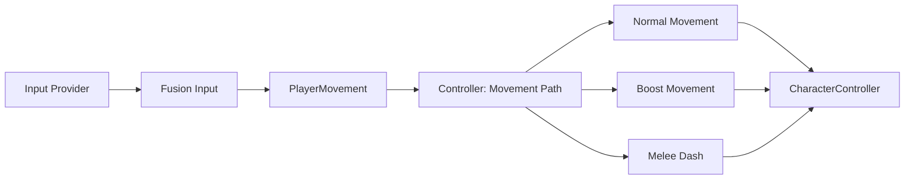

  <h1>R.I.P – Rusty Iron Project</h1>
  <h3>High-Speed Mecha Combat · Networked PvP · Modular Frames</h3>
  
Unity 6 기반 3D 메카 액션 프로젝트입니다. 고속 기동과 교체형 프레임·무기 조합을 중심으로 싱글 플레이와 네트워크 PvP를 구현합니다.

  

    
    
    
    
  

  
<a href="https://wjddh1998.itch.io/rusty-iron-project"><strong>⬇ Playable Windows Build</strong></a> · <a href="#code-samples"><strong>🧩 Review Code Samples</strong></a>

  
<a href="#overview">Overview</a> · <a href="#my-role">My Role</a> · <a href="#core-systems">Core Systems</a> · <a href="#code-samples">Code Samples</a> · <a href="#tech-stack">Tech Stack</a>

---

## Overview

| 항목 | 내용 |
|---|---|
| Genre | 3D Mecha Action · PvE · PvP |
| Development | 2026.06 – 2026.08 |
| Team | 3명 |
| Role | 팀장 · 전체 게임 기획 · Unity Client / Gameplay Programmer |
| Engine | Unity 6000.4.11f1 |
| Repository | 채용 검토용 Showcase |
| Playable Build | [Windows Alpha on itch.io](https://wjddh1998.itch.io/rusty-iron-project) |

## My Role

### 기획·설계

전체 게임 기획과 이동·부스트·에너지·타겟 탐색·전투·PvP 흐름을 정의했습니다. 입력·로드아웃·데미지·네트워크 식별의 공통 계약과 작업 단계를 문서화했습니다.

### 주요 개인 구현

- CharacterController 기반 이동·Quick Boost·Assault Boost와 이동 경로 제어
- 자유 시점·Hard Lock 카메라 구도, 장애물 보정과 부스트 전환
- 상·하체 프레임 조립, 스탯 적용, 파츠별 도색과 네트워크 빌드 동기화
- 로비 Ready·프로필·로드아웃 전달, 씬 진입·Spawn 및 매치 진행
- 참가자 준비·시각 준비 보고를 이용한 전투 인트로 시작 제어
- UGS 인증·프로필·로드아웃 저장, 랭킹 점수 조회·초기 등록
- 멀티 전투 HUD, 로컬 피격·ACS 경고, 탱크 궤도와 부스트 표현
- 프레임·무기용 Unity Editor 에셋 생성·등록·검색·검증 도구

### 공동 전투 시스템에서의 기여

ACS·레이저·다중 미사일·드론·근접 무기와 전투 계산 계층은 팀 공동 구현입니다. 이 영역에서는 프레임·장착 통합, 매치 피해 배율 연결, 로컬 피격 피드백을 담당했습니다.

## Core Systems

### 1. Networked Movement

입력 Provider가 작성한 Fusion 입력을 `PlayerMovement.FixedUpdateNetwork`에서 읽고 컨트롤러에 전달합니다. 컨트롤러는 근접 대시·Quick Boost·Assault Boost·일반 이동 경로를 선택하고 처리된 경로에서 반환합니다. 각 Motor의 이동 계산과 애니메이션·VFX·사운드 표현을 분리했습니다.

```mermaid
flowchart LR
    I[Input Provider] --> F[Fusion Input]
    F --> P[PlayerMovement]
    P --> N[Controller: Movement Path]
    N --> M[Normal Movement]
    N --> B[Boost Movement]
    N --> D[Melee Dash]
    M --> C[CharacterController]
    B --> C
    D --> C
```

### 2. Modular Frame & Paint

상·하체 ScriptableObject를 조회해 조립 본을 정렬하고 체력·에너지·이동 스탯을 적용합니다. 조립 완료 이벤트로 무기·히트박스·부스트 표현의 연결을 갱신합니다. 파츠 ID·도색·빌드 버전을 네트워크 상태로 유지하고 각 인스턴스가 외형을 재구성합니다. 상·하체 색은 독립적으로 지정하며 기존 단일 색 로드아웃도 처리합니다.

### 3. Battle Entry Readiness

씬·플레이어 준비와 로컬 시각 준비를 별도 단계로 관리합니다. 각 참가자가 카메라 준비 완료를 보고하면 State Authority가 모든 활성 참가자의 보고를 확인한 뒤 인트로 TickTimer를 시작합니다. 연출 종료 후 입력·HUD·피해 적용을 전투 상태로 전환합니다.

### 4. Authoritative Damage

팀 공동 전투 계층은 `DamageRequest → DamageResolver → DamageResolved`로 요청·계산·결과를 분리합니다. State Authority에서 무효화 필드·Shield·Armor·ACS 상태를 반영합니다. 개인 구현으로 매치별 피해 배율을 연결하고 AP 피해 발생 시 Input Authority에 피격 알림을 보내 로컬 UI에 반영했습니다.

### 5. Targeting

Hard Lock 후보는 레지스트리에서 생존·거리·Runner 조건을 검사하고 Controller에서 카메라와 대상 사이의 시야를 확인합니다. 무기 타겟 탐색은 별도로 Photon Fusion Lag Compensation 쿼리와 검색 각도·거리 조건을 사용합니다.

### 6. Match Flow

Host가 인원·Ready 조건을 확인해 시작을 요청하면 세션을 잠그고 Server가 씬 로딩·플레이어 Spawn을 진행합니다. 네트워크 MatchManager의 State Authority는 인트로·매치 타이머와 듀얼·FFA 결과를 관리합니다.

### 7. UGS Profile & Loadout

Unity Player Accounts 기반 로그인과 익명 게스트 경로를 UGS 인증에 연결했습니다. Cloud Save로 닉네임·로드아웃을 저장하고 프로필을 로비에 전달합니다. Leaderboards에서는 ELO 조회·초기 등록을 수행하며 비게스트 인증 조건을 랭크 방 생성·입장에 적용합니다.

### 8. Asset Authoring Tools

FBX 모델 또는 무기 프리팹에서 게임용 프리팹·ScriptableObject를 생성하고 DB에 등록하는 Editor 창을 구현했습니다. 관리 창에서는 파츠·무기를 검색하고 정의 오류·중복 ID를 확인하며 Inspector에서 편집합니다. 개인 구현을 중심으로 팀원의 무기 관련 확장이 포함된 프로젝트 전용 도구입니다.

## Code Samples

| 영역 | 코드 | 확인할 수 있는 내용 |
|---|---|---|
| Modular Frame | [CodeSamples/ModularFrame](./CodeSamples/ModularFrame/README.md) | 파츠 정의·조회, 조립 본 정렬, 스탯 적용, 빌드 버전 동기화 |
| Battle Readiness | [CodeSamples/BattleReadiness](./CodeSamples/BattleReadiness/README.md) | 참가자 준비 RPC, 시각 준비 단계, Authority 타이머, 카메라·HUD 인계 |
| Player Services | [CodeSamples/PlayerServices](./CodeSamples/PlayerServices/README.md) | 인증 수명주기 확인, Cloud Save, 저장 직렬화, 점수 조회·초기 등록 |
| Movement | [CodeSamples/Movement](./CodeSamples/Movement/README.md) | 네트워크 입력 소비, 수직·수평 이동, 에너지 소비와 회전 |
| Targeting | [CodeSamples/Targeting](./CodeSamples/Targeting/README.md) | Hard Lock 후보·시야 검사, Lag Compensation 무기 탐색 |
| Combat | [CodeSamples/Combat](./CodeSamples/Combat/README.md) | 팀 공동 Request–Resolver–Result 구조와 Authority 규칙 |
| Frame Presentation | [CodeSamples/FramePresentation](./CodeSamples/FramePresentation/README.md) | 색 패킹·로드아웃 호환, 전진·회전에 반응하는 좌우 궤도 표현 |
| Asset Tools | [CodeSamples/AssetTools](./CodeSamples/AssetTools/README.md) | 프리팹·SO 생성·등록, 검증, 삭제 시 DB 참조 정리 |

## Tech Stack

| 분류 | 기술 |
|---|---|
| Engine | Unity 6000.4.11f1 · URP |
| Language | C# |
| Networking | Photon Fusion 2 · Host Mode · State Authority |
| Backend | Unity Gaming Services Authentication · Cloud Save · Leaderboards |
| Gameplay | CharacterController · Modular Frames / Weapons · Projectile · Shield · ACS |
| Tools | Unity Editor Tools · Git · GitHub · Notion |

## Repository Scope

이 저장소는 채용 검토용 Showcase입니다. 공개 코드는 개인 구현과 팀 공동 구현에서 선별했으며 기여 범위를 각 설명에 표시합니다. 원본 Unity 프로젝트는 팀 작업물과 라이선스가 있는 외부 에셋을 포함해 Private으로 유지합니다.

샘플은 시스템 책임을 검토하기 위한 소스이며 전체 의존성과 에셋을 포함하지 않아 단독 실행되지 않습니다. 일부 파일은 원본 클래스의 관련 멤버만 담은 발췌본입니다.

## Usage Notice

이 저장소의 코드와 문서는 포트폴리오 검토 목적으로 공개합니다. 별도 라이선스가 명시되지 않은 자료의 복제·재배포 권한은 부여하지 않습니다.
